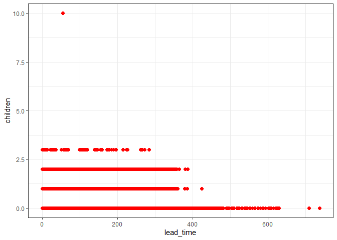
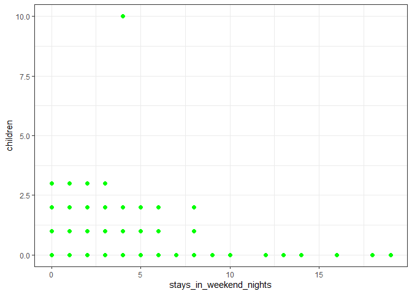

Hotel_data_Analysis
================
Sanjay
2023-07-29

## Setting up my environmet

Notes: setting up my R environment by loading the `tidyverse` packages

``` r
library(tidyverse)
```

    ## ── Attaching core tidyverse packages ──────────────────────── tidyverse 2.0.0 ──
    ## ✔ dplyr     1.1.2     ✔ readr     2.1.4
    ## ✔ forcats   1.0.0     ✔ stringr   1.5.0
    ## ✔ ggplot2   3.4.2     ✔ tibble    3.2.1
    ## ✔ lubridate 1.9.2     ✔ tidyr     1.3.0
    ## ✔ purrr     1.0.1     
    ## ── Conflicts ────────────────────────────────────────── tidyverse_conflicts() ──
    ## ✖ dplyr::filter() masks stats::filter()
    ## ✖ dplyr::lag()    masks stats::lag()
    ## ℹ Use the conflicted package (<http://conflicted.r-lib.org/>) to force all conflicts to become errors

## Loading the dataset

Here,we will load the ‘hotel_bookings.csv’ and save it as a data frame
called `bookings_df`

``` r
bookings_df<-read.csv("C:/Users/ASUS/OneDrive/Desktop/hotel_bookings.csv")
bookings_df
```

## Data Exploration

Here,we will explore the data by using functions such as `head`
,`glimpse` and others

``` r
head(bookings_df)
str(bookings_df)
glimpse(bookings_df)
colnames(bookings_df)
```

## Data Cleaning

1.  Interested in the following variables: hotel, is_canceled,
    lead_time.

``` r
trimmed_df<-bookings_df %>% 
  select(hotel,is_canceled,lead_time) %>% 
  rename(hotel_type=hotel)
trimmed_df
```

    ## # A tibble: 119,390 × 3
    ##    hotel_type   is_canceled lead_time
    ##    <chr>              <int>     <int>
    ##  1 Resort Hotel           0       342
    ##  2 Resort Hotel           0       737
    ##  3 Resort Hotel           0         7
    ##  4 Resort Hotel           0        13
    ##  5 Resort Hotel           0        14
    ##  6 Resort Hotel           0        14
    ##  7 Resort Hotel           0         0
    ##  8 Resort Hotel           0         9
    ##  9 Resort Hotel           1        85
    ## 10 Resort Hotel           1        75
    ## # ℹ 119,380 more rows

2.  Here we will combine the arrival month and year into one column
    using the `unite()` function:

``` r
arrival<-bookings_df %>% 
   select(arrival_date_year,arrival_date_month) %>% 
  unite(arrival_month_year,c("arrival_date_month","arrival_date_year"),sep = " ")
arrival
```

    ## # A tibble: 119,390 × 1
    ##    arrival_month_year
    ##    <chr>             
    ##  1 July 2015         
    ##  2 July 2015         
    ##  3 July 2015         
    ##  4 July 2015         
    ##  5 July 2015         
    ##  6 July 2015         
    ##  7 July 2015         
    ##  8 July 2015         
    ##  9 July 2015         
    ## 10 July 2015         
    ## # ℹ 119,380 more rows

3.  Here we will combine adults,children and babies as `Guests`by using
    the mutate function

``` r
guests<-bookings_df %>% 
  select(adults,children,babies) %>% 
  mutate(guests=adults+children+babies)
guests
```

    ## # A tibble: 119,390 × 4
    ##    adults children babies guests
    ##     <int>    <int>  <int>  <int>
    ##  1      2        0      0      2
    ##  2      2        0      0      2
    ##  3      1        0      0      1
    ##  4      1        0      0      1
    ##  5      2        0      0      2
    ##  6      2        0      0      2
    ##  7      2        0      0      2
    ##  8      2        0      0      2
    ##  9      2        0      0      2
    ## 10      2        0      0      2
    ## # ℹ 119,380 more rows

4.calculate the total cancled bookings and average lead time by using
the `summarize` function.

``` r
calculate<-bookings_df %>%
  summarize(total_cancled_bookings=sum(is_canceled),
            average_lead_time=mean(lead_time))
calculate
```

    ## # A tibble: 1 × 2
    ##   total_cancled_bookings average_lead_time
    ##                    <int>             <dbl>
    ## 1                  44224              104.

## Data Manupulation

- Data with the max and min lead time

``` r
max(bookings_df$lead_time)
```

    ## [1] 737

``` r
min(bookings_df$is_canceled)
```

    ## [1] 0

- Average lead_time for the hotel_type

``` r
summary<-bookings_df %>% 
  group_by(hotel) %>% 
  summarize(average_lead_time=mean(lead_time),
            minimum_lead_time=min(lead_time),
            maximum_lead_time=max(lead_time))
summary
```

    ## # A tibble: 2 × 4
    ##   hotel        average_lead_time minimum_lead_time maximum_lead_time
    ##   <chr>                    <dbl>             <int>             <int>
    ## 1 City Hotel               110.                  0               629
    ## 2 Resort Hotel              92.7                 0               737

## Data Visaualizations

Here,we will go through series of visaualizations

### To determine if people with children book hotel rooms in advance.

``` r
ggplot(bookings_df,aes(lead_time,children))+
  geom_point(size=2,color='red')+
  theme_bw()
```

<!-- -->

### To determine if guests without children book the most weekend nights

``` r
ggplot(bookings_df,aes(stays_in_weekend_nights,children ))+
  geom_point(size=2,color='green')+
  theme_bw()
```

<!-- -->
